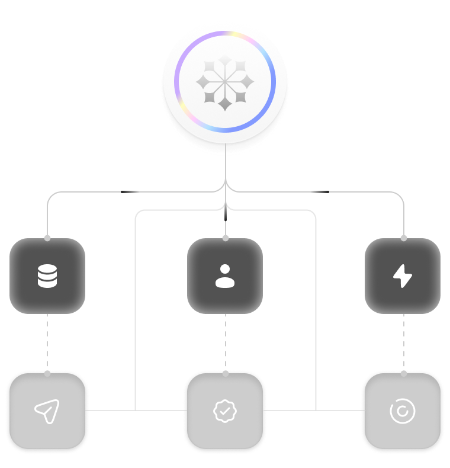
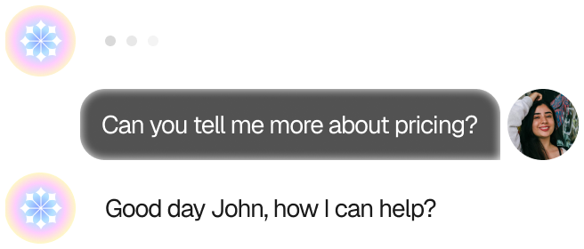
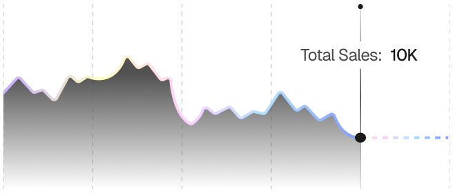
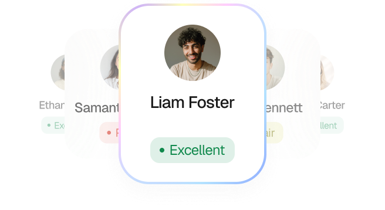
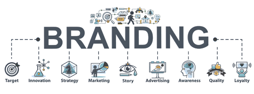
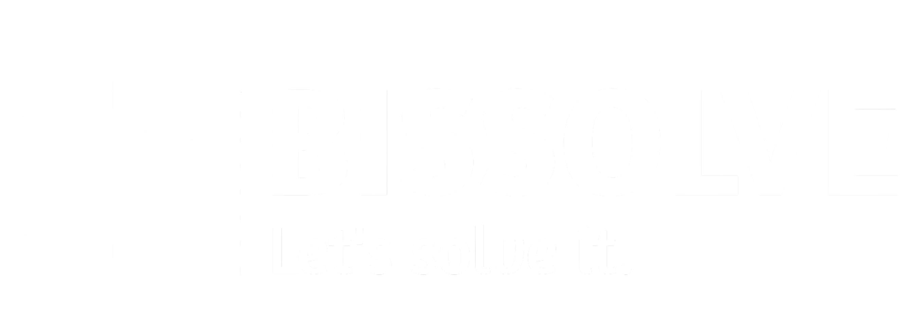

Saved at path
  Relative: index.md
  Absolute: /Users/niyasbasheer/Downloads/website-main/index.md
on, .process-line, .about-text, .preload-logo, .preload-text) { visibility: hidden !important; } .navbar-brand-logo { width: 2.2rem !important; height: 2.2rem !important; object-fit: contain !important; padding: 0 !important; aspect-ratio: 1 !important; } .navbar-brand-link { padding: 0.6rem !important; display: flex !important; align-items: center !important; justify-content: center !important; } !function (o, c) { var n = c.documentElement, t = " w-mod-"; n.className += t + "js", ("ontouchstart" in o || o.DocumentTouch && c instanceof DocumentTouch) && (n.className += t + "touch") }(window, document);    window.dataLayer = window.dataLayer || \[\]; function gtag() { dataLayer.push(arguments); } gtag('js', new Date()); gtag('config', 'G-J3KYXNLBYW', { send\_page\_view: true, cookie\_flags: 'SameSite=None;Secure' }); document.addEventListener('DOMContentLoaded', function () { // ── 1. SCROLL DEPTH ────────────────────────────────────────────────────── var scrollMarks = \[25, 50, 75, 90, 100\]; var firedScrollMarks = {}; window.addEventListener('scroll', function () { var scrolled = Math.round((window.scrollY / (document.body.scrollHeight - window.innerHeight)) \* 100); scrollMarks.forEach(function (mark) { if (scrolled >= mark && !firedScrollMarks\[mark\]) { firedScrollMarks\[mark\] = true; gtag('event', 'scroll\_depth', { depth\_percentage: mark }); } }); }, { passive: true }); // ── 2. SECTION VISIBILITY (Intersection Observer) ───────────────────────── var sections = document.querySelectorAll('section\[id\]'); var sectionObserver = new IntersectionObserver(function (entries) { entries.forEach(function (entry) { if (entry.isIntersecting) { gtag('event', 'section\_view', { section\_id: entry.target.id }); } }); }, { threshold: 0.3 }); sections.forEach(function (s) { sectionObserver.observe(s); }); // ── 3. BUTTON & CTA CLICKS ─────────────────────────────────────────────── document.querySelectorAll('a, button').forEach(function (el) { el.addEventListener('click', function () { var label = el.innerText.trim() || el.getAttribute('aria-label') || el.getAttribute('href') || 'unknown'; var href = el.getAttribute('href') || ''; var isExternal = href.startsWith('http') && !href.includes(window.location.hostname); gtag('event', isExternal ? 'outbound\_link\_click' : 'button\_click', { element\_text: label.substring(0, 100), element\_href: href }); }); }); // ── 4. FORM INTERACTIONS ───────────────────────────────────────────────── document.querySelectorAll('form').forEach(function (form) { // Track when user starts filling the form form.addEventListener('focusin', function (e) { if (!form.\_started) { form.\_started = true; gtag('event', 'form\_start', { form\_id: form.id || 'unnamed\_form' }); } }); // Track submissions form.addEventListener('submit', function () { gtag('event', 'form\_submit', { form\_id: form.id || 'unnamed\_form' }); }); }); // ── 5. VIDEO INTERACTIONS ───────────────────────────────────────────────── document.querySelectorAll('video').forEach(function (video, i) { var videoId = video.id || ('video\_' + i); video.addEventListener('play', function () { gtag('event', 'video\_play', { video\_id: videoId }); }); video.addEventListener('pause', function () { gtag('event', 'video\_pause', { video\_id: videoId, time: Math.round(video.currentTime) }); }); video.addEventListener('ended', function () { gtag('event', 'video\_complete', { video\_id: videoId }); }); }); // ── 6. TIME ON PAGE (fires at 30s, 60s, 3m, 5m) ────────────────────────── \[30, 60, 180, 300\].forEach(function (sec) { setTimeout(function () { gtag('event', 'time\_on\_page', { seconds: sec }); }, sec \* 1000); }); // ── 7. COPY TEXT ────────────────────────────────────────────────────────── document.addEventListener('copy', function () { var selected = window.getSelection().toString().substring(0, 100); gtag('event', 'text\_copied', { copied\_text: selected }); }); // ── 8. PAGE EXIT INTENT (mouse leaves viewport top) ─────────────────────── document.addEventListener('mouseleave', function (e) { if (e.clientY < 10) { gtag('event', 'exit\_intent', { page: window.location.pathname }); } }); });

/\* Make mask on both sides \*/ .mask-wrapper { -webkit-mask-image: linear-gradient(to right, transparent 0%, black 15%, black 85%, transparent 100%); mask-image: linear-gradient(to right, transparent 0%, black 15%, black 85%, transparent 100%); } /\* Make text look crisper and more legible in all browsers \*/ body { -webkit-font-smoothing: antialiased; -moz-osx-font-smoothing: grayscale; font-smoothing: antialiased; text-rendering: optimizeLegibility; } /\* Focus state style for keyboard navigation for the focusable elements \*/ \*\[tabindex\]:focus-visible, input\[type="file"\]:focus-visible { outline: 0.125rem solid #4d65ff; outline-offset: 0.125rem; } /\* Set color style to inherit \*/ .inherit-color \* { color: inherit; } /\* Get rid of top margin on first element in any rich text element \*/ .w-richtext> :not(div):first-child, .w-richtext>div:first-child> :first-child { margin-top: 0 !important; } /\* Get rid of bottom margin on last element in any rich text element \*/ .w-richtext>:last-child, .w-richtext ol li:last-child, .w-richtext ul li:last-child { margin-bottom: 0 !important; } /\* Make sure containers never lose their center alignment \*/ .container-medium, .container-small, .container-large { margin-right: auto !important; margin-left: auto !important; } /\* Make the following elements inherit typography styles from the parent and not have hardcoded values. Important: You will not be able to style for example "All Links" in Designer with this CSS applied. Uncomment this CSS to use it in the project. Leave this message for future hand-off. \*/ /\* a, .w-input, .w-select, .w-tab-link, .w-nav-link, .w-dropdown-btn, .w-dropdown-toggle, .w-dropdown-link { color: inherit; text-decoration: inherit; font-size: inherit; } \*/ /\* Apply "..." after 3 lines of text \*/ .text-style-3lines { display: -webkit-box; overflow: hidden; -webkit-line-clamp: 3; -webkit-box-orient: vertical; } /\* Apply "..." after 2 lines of text \*/ .text-style-2lines { display: -webkit-box; overflow: hidden; -webkit-line-clamp: 2; -webkit-box-orient: vertical; } /\* These classes are never overwritten \*/ .hide { display: none !important; } @media screen and (max-width: 991px) { .hide, .hide-tablet { display: none !important; } } @media screen and (max-width: 767px) { .hide-mobile-landscape { display: none !important; } } @media screen and (max-width: 479px) { .hide-mobile { display: none !important; } } .margin-0 { margin: 0rem !important; } .padding-0 { padding: 0rem !important; } .spacing-clean { padding: 0rem !important; margin: 0rem !important; } .margin-top { margin-right: 0rem !important; margin-bottom: 0rem !important; margin-left: 0rem !important; } .padding-top { padding-right: 0rem !important; padding-bottom: 0rem !important; padding-left: 0rem !important; } .margin-right { margin-top: 0rem !important; margin-bottom: 0rem !important; margin-left: 0rem !important; } .padding-right { padding-top: 0rem !important; padding-bottom: 0rem !important; padding-left: 0rem !important; } .margin-bottom { margin-top: 0rem !important; margin-right: 0rem !important; margin-left: 0rem !important; } .padding-bottom { padding-top: 0rem !important; padding-right: 0rem !important; padding-left: 0rem !important; } .margin-left { margin-top: 0rem !important; margin-right: 0rem !important; margin-bottom: 0rem !important; } .padding-left { padding-top: 0rem !important; padding-right: 0rem !important; padding-bottom: 0rem !important; } .margin-horizontal { margin-top: 0rem !important; margin-bottom: 0rem !important; } .padding-horizontal { padding-top: 0rem !important; padding-bottom: 0rem !important; } .margin-vertical { margin-right: 0rem !important; margin-left: 0rem !important; } .padding-vertical { padding-right: 0rem !important; padding-left: 0rem !important; }

Bissolve

Menu

[

Book a meeting

](calendar.html)

[About](#about-section) [Values](#values-section) [Services](#service-section) [Process](#process-section) [Integrations](#integrations-section) [FAQs](#FAQ-section) [Book a Meeting](calendar.html)

Technology That Works  
As Hard As You Do.
==========================================

Bissolve builds and manages the technology systems that help businesses grow,  
automate, and scale, without the complexity that usually comes with it.

Let's solve it.
---------------

[

Explore Our Services

](#service-section)

 

001

who we are

We help startups, SMEs, and growing businesses design and deploy the technology systems they actually need, from AI voice agents and CRM platforms to automation workflows, websites, apps, and complete brand identity.

500+

saved hours

80%

productivity boost

5x

faster response

500+

saved hours

80%

productivity boost

5x

faster response

002

values

Why Choose Us?
--------------

We build AI-powered automation systems that eliminate manual work, reduce costs, and multiply your business performance.

01

Built Around Your Business

Every solution is scoped and built specifically for the way you operate. No templates. No shortcuts.

02

One Team for Everything

CRM, AI, automation, web, apps, and branding, all under one roof. One point of contact. Full accountability.

03

We Stay After Delivery

We don't hand over and disappear. Every solution comes with ongoing support from the team that built it.

003

Capabilities

Our Services
------------

AI Workflow Automation. Automate repetitive tasks across departments using intelligent triggers and decision logic. We connect your tools and eliminate the manual work, from lead capture to internal workflows to reporting.

Workflow mapping

Real-time system integration.

Validated output

AI Voice Agents & Chatbots. Intelligent agents that handle inbound and outbound calls, qualify leads, respond to messages, and book appointments. 24 hours a day, across phone, WhatsApp, SMS, and web.

E-Commerce. Shopify and WordPress stores built end-to-end design, products, payments, shipping, and automation fully configured.

CRM & Sales Automation. Pipeline automation, AI lead scoring, follow-ups, predictive insights.

Website & Web Application Development. Custom websites and web applications built on modern technology — fast, secure, and built to convert.

Mobile App Development. IOS and Android applications built cross-platform with Flutter, for client-facing products and internal business tools.

Branding. Complete visual identity systems. Logo, brand guidelines, and all digital and print assets your business needs to look the part.

Not sure where to start?

Book a free 30-minute AI strategy session. We’ll analyze your current workflows and identify the highest-ROI automation opportunities for your business.

[

Schedule a Session

](#CTA-Form)

Your Data. Protected. Always.

End-to-End Encryption

Secure API Integrations

Role-Based Access Control

Data Minimization

004

process

How We Work
-----------

A proven process designed to transform complex workflows into scalable systems, efficiently and strategically.

01

Discovery & Audit

We listen first. One honest conversation about your business, what's working, what isn't, and where technology can make a real difference.

Scoping & Planning

A clear, specific plan. What we'll build, how long it takes, and what the outcome looks like. No vague proposals. No surprises.

02

03

Build & Integration

Our team handles everything, design, development, configuration, and integration with your existing tools.

Testing & Optimization

We test every system thoroughly before handover, real scenarios, edge cases, and full QA to make sure everything works exactly as intended.

04

05

Delivery & Ongoing Support

Full handover with documentation and training where needed. Then we stay involved, maintaining, updating, and improving what we built.

006

integrations

Technology Ecosystem
--------------------

[

Try with Bissolve

](#CTA-Form)

HubSpot

Salesforce

Zoho

Mailchimp

ActiveCampaign

Zapier

OpenAI

Cloud AI

Make

Custom APIs

HubSpot

Salesforce

Zoho

Mailchimp

ActiveCampaign

Zapier

OpenAI

Cloud AI

Make

Custom APIs

Pipedrive

Monday

Copper

Close

Klaviyo

Marketo

Brevo

ConvertKit

N8N

Customerio

Pipedrive

Monday

Copper

Close

Klaviyo

Marketo

Brevo

ConvertKit

N8N

Customerio

Pabbly

Workato

Anthropic

Vertex

Azure

Hugging

Intercom

Drift

Crisp

LiveChat

Pabbly

Workato

Anthropic

Vertex

Azure

Hugging

Intercom

Drift

Crisp

LiveChat

Our technology stack connects data, workflows, and platforms into a secure, high-performance system built around your business.

010

FAQs

Common Questions
----------------

1

What industries do you work with?

We work with businesses across all industries, real estate, healthcare, retail, education, logistics, hospitality, and professional services. If there's a technology problem in your business, there's a good chance we've solved one like it before.

2

Do you work with international clients?

Yes. We actively serve clients in the US, UK, Middle East, and India. Our primary focus is the US market.

3

How long does a project take?

It depends on the scope. A basic automation workflow can be live in 2–3 days. A full CRM build takes 1–2 weeks. A custom web or mobile application takes 4–12 weeks. We always give you a clear timeline before we start.

4

Do you offer ongoing support after delivery?

Yes. Every project includes a post-launch support period. We also offer monthly retainers for ongoing management, maintenance, and continued development.

5

How do I get started?

Book a free 30-minute discovery session. We'll listen to what your business needs and tell you honestly what we'd recommend, no sales pitch, no pressure.

Have any other questions?

[

Contact Us

](#CTA-Form)

Your Competitors Are Automating.  
Are you?
-------------------------------------------

Stop wasting time on manual processes. Start building a self-running business.

Thank you!

Your submission has been received!

[

LinkedIn

](https://www.linkedin.com/company/bissolve/)[

Instagram

](https://www.instagram.com/bissolve_/)[

Facebook

](https://www.facebook.com/profile.php?id=61578511911291)[

Twitter X

](https://www.x.com/bissolve_)

[About](#about-section) [Services](#service-section) [FAQs](#FAQ-section)

© Bissolve 2026

 

(function () { // 🔁 Paste your deployed Google Apps Script URL here var SCRIPT\_URL = 'https://script.google.com/macros/s/AKfycbxkbScaXyV-AqV9UfbnWNaBCC3iUe2QUEhynzeW3TyAceqXKTA9uoG3BJCArPBBR91paA/exec'; var form = document.getElementById('email-form'); var successMsg = document.querySelector('.w-form-done'); var errorMsg = document.querySelector('.w-form-fail'); var submitBtn = form ? form.querySelector('\[type="submit"\]') : null; if (!form) return; form.addEventListener('submit', function (e) { e.preventDefault(); var originalText = submitBtn.value; submitBtn.value = 'Sending…'; submitBtn.disabled = true; errorMsg.style.display = 'none'; successMsg.style.display = 'none'; var payload = { name: document.getElementById('Name').value.trim(), company: document.getElementById('Company').value.trim(), email: document.getElementById('Email').value.trim(), message: document.getElementById('Share-project-details').value.trim(), page: window.location.href, time: new Date().toLocaleString() }; // Send to Google Apps Script (no-cors so response is opaque — data still saves) fetch(SCRIPT\_URL, { method: 'POST', mode: 'no-cors', headers: { 'Content-Type': 'text/plain' }, body: JSON.stringify(payload) }) .then(function () { form.style.display = 'none'; successMsg.style.display = 'block'; form.reset(); // Track in GA4 if (typeof gtag === 'function') { gtag('event', 'form\_submit\_success', { form\_id: 'email-form' }); } }) .catch(function () { errorMsg.style.display = 'block'; submitBtn.value = originalText; submitBtn.disabled = false; }); }); })();